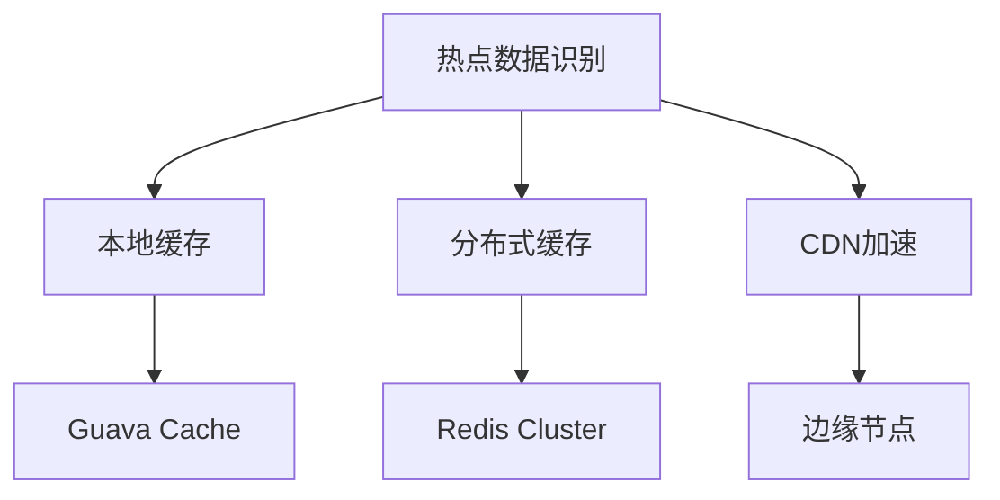

# 🚀 秒杀系统设计：从质疑到落地的工程思维

> *"对问题的质疑本身就是解决方案的一部分"* —— 这是我在系统设计中的第一课

## 📋 目录
- [🎯 核心观点](#-核心观点)
- [🤔 第一层思考：质疑问题本身](#-第一层思考质疑问题本身)
- [🏗️ 第二层思考：系统设计的三大支柱](#-第二层思考系统设计的三大支柱)
- [🔄 第三层思考：四步设计方法论](#-第三层思考四步设计方法论)
- [💡 gt的补充观点](#-gt的补充观点)
- [📚 参考资料与延伸阅读](#-参考资料与延伸阅读)
- [📝 原始口述稿存档](#-原始口述稿存档)

---

## 🎯 核心观点

秒杀系统设计不是一个简单的技术问题，而是一个需要**分而治之**、**具体问题具体分析**的工程思维问题。与其套用模板，不如深入理解业务上下文，在**高并发**、**高可用**、**一致性**三个维度上找到平衡点。

---

## 🤔 第一层思考：质疑问题本身

### 为什么质疑问题很重要？

> *"一句话很难定义一个具体的方案"*

在系统设计中，我始终坚持一个观点：**问题本身往往比答案更重要**。秒杀系统看似是一个标准化的技术问题，但实际上：

1. **业务场景千差万别**：电商秒杀、课程抢购、演唱会票务...每种场景都有其特殊性
2. **约束条件各不相同**：预算、时间、团队能力、业务复杂度
3. **动态性**：业务需求会变化，技术方案也需要迭代

### 避免"教条主义"陷阱

经验固然重要，但**不要被经验束缚**。就像罗翔老师常说的："法律的生命不在于逻辑，而在于经验"——但经验必须服务于具体问题的解决，而不是成为思维的枷锁。

---

## 🏗️ 第二层思考：系统设计的三大支柱

### 1️⃣ 高并发：热点数据的精准打击

#### 核心思想：**分而治之，好钢用在刀刃上**

高并发不是全局性问题，而是**热点数据**的问题。很少有整个业务都是高频访问的，我们需要：

- **识别热点**：动态探测 vs 静态配置
- **分层缓存**：本地缓存 + 分布式缓存
- **智能路由**：CDN + 负载均衡

#### 技术策略

**京东Hot Key中间件**：动态探测热点key，根据单位时间访问次数自动识别，这正是应对变化业务的智慧。

### 2️⃣ 高可用：集群化 + 限流防护

#### 核心思想：**避免单点故障，控制并发容量**

高可用不是无限可用，而是在**预期范围内**的可用：

- **集群化部署**：Redis哨兵、主从、集群模式
- **限流防护**：Sentinel、Hystrix等组件
- **降级策略**：核心功能优先，非核心功能可降级

#### 实际案例：B站《凡人修仙传》

> 韩立结婴那集，系统几乎加载不出来，但视频本身是可用的，选题功能直到晚上才恢复。

这正体现了**分而治之**的智慧：用户最关心的是能看到最新一集，选题功能相对不那么重要。

### 3️⃣ 一致性：性能与强一致性的平衡

#### 核心思想：**最终一致性 > 强一致性（除特殊场景）**

一致性问题的复杂性在于：

1. **技术问题**：数据库锁、分布式锁
2. **攻击问题**：刷单、恶意请求
3. **性能问题**：一致性成本 vs 系统性能

#### 库存扣减策略对比

| 策略 | 优点 | 缺点 | 适用场景 |
|------|------|------|----------|
| 下单时扣减 | 简单直接 | 可能被刷单 | 库存充足 |
| 付款时扣减 | 避免刷单 | 可能无法付款 | 库存紧张 |
| 预扣减 | 平衡性能与一致性 | 实现复杂 | 高并发场景 |

> *"网络本来是安全的，但有人开始研究网络安全后，网络就变得不安全了"* —— 《白帽子讲Web安全》

这提醒我们：很多"技术问题"实际上是**人为攻击问题**，我们的方案是让攻击成本变得更高，而不是完全避免。

---

## 🔄 第三层思考：四步设计方法论

### 第一步：基于业务上下文的细化

- **约束条件分析**：预算、时间、团队能力
- **业务流程梳理**：从用户下单到完成支付的完整链路
- **协作机制**：与产品、运营、测试等角色的配合

### 第二步：用户规模与使用习惯分析

- **用户规模预测**：决定系统规模和资源配置
- **使用习惯分析**：集中式 vs 分散式访问
- **基准值建立**：QPS、响应时间等性能指标

### 第三步：持续优化与迭代

- **业务链路优化**：精简流程，提高效率
- **技术层面优化**：数据库设计、索引优化
- **监控与反馈**：日志分析、性能测试

### 第四步：性能验证

- **压测工具**：JMeter、Apache Bench (ab)
- **性能基准**：建立可量化的性能目标
- **持续监控**：生产环境的性能表现

---

## 💡 gt的补充观点

### 1. 系统设计的哲学思考

系统设计不是简单的技术选型，而是一种**工程哲学**。就像建筑师设计建筑，不仅要考虑结构安全，还要考虑美学、实用性、成本等多个维度。

### 2. 关于"完美方案"的思考

> *"没有完美的方案，只有最适合当前约束条件的方案"*

追求完美往往会导致过度设计。在系统设计中，**80/20法则**同样适用：80%的效果往往来自20%的核心设计。

### 3. 技术债务的辩证看待

技术债务不是洪水猛兽，而是一种**投资策略**。在业务快速发展期，适当的技术债务是必要的，关键是要有**偿还计划**。

### 4. 关于"热点数据"的深度思考

热点数据不仅存在于缓存层面，还存在于：
- **数据库层面**：读写分离、分库分表
- **应用层面**：连接池、线程池
- **网络层面**：带宽、延迟

---

## 📚 参考资料与延伸阅读

- [京东Hot Key中间件](https://github.com/jd-opensource/hotkey)
- [Sentinel限流组件](https://github.com/alibaba/Sentinel)
- [Hystrix熔断器](https://github.com/Netflix/Hystrix)
- 《白帽子讲Web安全》
- 《高性能MySQL》
- 《分布式系统概念与设计》

---

## 📝 原始口述稿存档

> 以下内容为用户的原始口述记录，保留作为存档参考

### 用户关于秒杀系统设计的思考记录

**主题**：如何设计一个秒杀系统

**第一个想法**：质疑问题本身
- 一个问题过于单薄，需要收集更多信息
- 一句话很难定义一个具体的方案
- 需要质疑这个问题

**面对这类问题的策略**：
1. **业务上下文**：通用的策略，不管什么设计问题都有业务上下文
   - 秒杀、营销、转账都有业务上下文
   - 可能有相似之处，但需要具体问题具体分析
   - 不要有通用的教条主义
   - 经验能赋予熟练操作，但不应被束缚
   - 实际问题是动态的，不是静态的

2. **高并发、高可用、一致性**：分布式高性能场景下需要解决的问题

**高并发**：
- 隐含上下文：针对一类业务或某块数据的高频访问
- 很少有整个业务全是高频的
- 需要分而治之，好钢用在刀刃上
- 不要整个全局都做高并发，要针对性设计
- 成本考虑，分情况讨论，不要做无用功
- 热点数据：需要被频繁访问的数据
- 策略：
  - 缓存：基于JVM的本地缓存 + 分布式缓存
  - 京东中间件Hot Key：动态探测热点key
    - 根据单位时间访问次数决定是否为热点key
    - 可配置
  - CDN：对静态资源的高并发应对方案
- 目前笔记包含这两个维度，可以扩展但不用太复杂

**高可用**：
- 最常规思路：集群化，避免单点故障
- 常见方案：Redis通过集群部署（哨兵、主从、集群）
- 除了集群还有限流方案：
  - "请稍后再试"
  - Sentinel组件（淘宝双十一验证过）
  - Hystrix组件
- 通过组件做限流，关注系统并发容量的防护
- 上限设定：10万并发或1万并发
- 压测时把目标定在上限，超过就限流
- 不管实际并发量达到什么规模，只要方案满足预期就可以
- 动态调整跟着业务走
- 案例：B站《凡人修仙传》韩立结婴那集
  - 系统几乎加载不出来
  - 保证视频可用，不保证选题可用
  - 用户更关心看到最新一集，选题相对不重要
  - 体现了分而治之的思想

**一致性**：
- 特殊场景：订单的卖不出去和超卖问题
- 经典场景，但一致性是方向，不局限于某个业务
- 订单问题举例：
  - 扣减库存方式：下单时扣减、付款时扣减、预扣减
  - 攻防相关话题：
    - 下单时扣减：可能遇到刷单问题
    - 付款时扣减：可能遇到下单后无法付款
    - 预扣减：应对刷单情况
  - 目前没有完美方案，都是解决一些问题带来新问题
  - 只要最终方案能解决当下问题就可以
- 参考《白帽子讲Web安全》：
  - "网络本来是安全的，但有人研究网络安全后，网络就变得不安全"
  - 很多一致性问题是应对人为问题，如刷单
  - 这不是技术问题，是人为的、攻击性的问题
  - 一致性问题除了解决技术问题，还要解决攻击问题
- 攻击手段没有完全避免的方案
- 目前方案：如锁IP或防护，都是让攻击成本变得更高
- 技术实现：数据库排他锁（select for update）、分布式锁
- 一致性另一个点：性能
- 系统设计者需要考虑一致性成本和性能损耗的平衡
- 最终目标：系统处于相对稳态，可用且保持一定一致性
- 不可能为了强一致性完全牺牲性能
- 最终只有100个用户可用不是预期效果
- 能够完成大部分用户可用以及相对强的一致性更好
- 除极端场景（如银行扣款业务）需要强一致性
- 大多数场景实现最终一致性就可以

**系统设计完成后**：
- 需要做性能测试：压测
- 工具：JMeter、Apache Bench (ab)
- 目前三个思路：
  1. 业务上下文到底是什么情况
  2. 需要达到什么样的高性能水平（并发、可用性、一致性）
  3. 最终做落地的压测

**基于文章的系统设计思路延伸**：
分为四步：

1. **基于业务上下文**：
   - 细化问题：系统中有哪些约束条件
   - 业务上下文背景
   - 职业化思考
   - 与同事协作解决具体问题
   - 需要对业务整个运作流程了解
   - 关于问题的细化，需要研究问题

2. **高并发基础背景**：
   - 用户规模是多少
   - 需要做预测或有数据做判断
   - 用户规模决定系统规模、服务器数量、最终效果
   - 用户规模很重要
   - 除了用户规模，还有用户使用习惯
   - 针对秒杀场景：用户堆在一起 vs 分散使用
   - 需要根据具体问题分析，不能一概而论
   - 可以通过日志监控做持续迭代
   - 不断观察系统用户使用情况
   - 有预期的基准值，如QPS
   - 做性能测试有可靠数据

3. **通用思想**：
   - 流行想法：在执行时不断优化
   - 目前项目用迭代形式，不是瀑布流
   - 只需要在做时不断优化
   - 很多业务需求是持续的，不是单个活动
   - 可能经常会有，需要在做时不断优化
   - 优化方向：
     - 业务链路：能否再精简，更高效
     - 数据库字段设计、索引等
     - 技术方面有较多延伸

4. **综合思考**：
   - 系统设计是很大的话题，与架构强相关
   - 需要融会贯通，不简单
   - 需要长期积累，持续关注
   - 有什么最新思想，是很好的积累方向

**总结**：关于这一块，笔记内容已经讲清楚，希望帮助总结、结构化，根据自身经验提出想法和观念，最后输出一份markdown文档，口述稿保存在笔记最后做存档。
