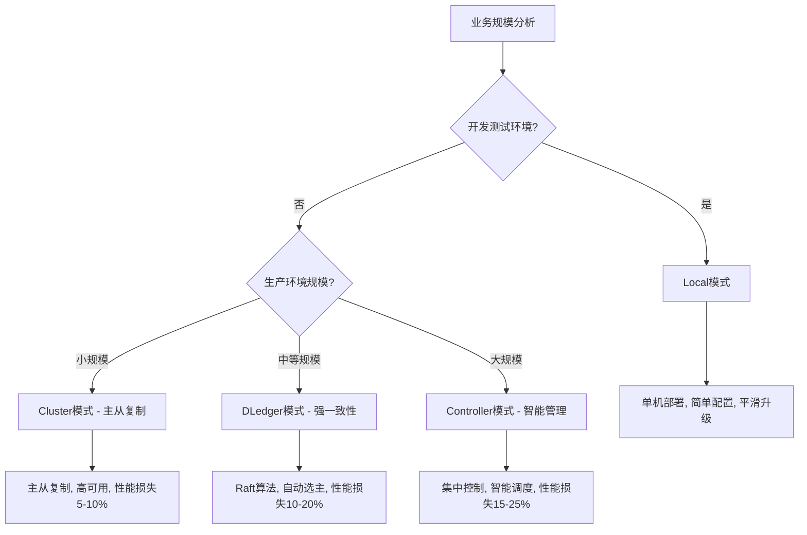

# 🚀 RocketMQ部署模式导航

## 🧠 **思维路线导读**

本文作为RocketMQ部署模式的**快速导航指南**，帮助你在官方详细文档的基础上快速理解部署模式的选择逻辑和核心机制。我们重点关注：

1. **部署模式选择逻辑**：什么场景选择什么模式
2. **核心机制解析**：高可用、故障转移等关键技术点
3. **官方建议总结**：基于官方文档的最佳实践建议

> **💡 官方建议**：一般情况下如果没有特殊需求，或者遵循从早期版本平滑升级的思路，可以选用Local模式。

## 📋 **部署模式快速导航**

### **部署模式选择逻辑**

```
业务规模分析 → 部署模式选择
     ↓              ↓
开发测试环境    → Local模式（单机部署）
中小规模生产    → Cluster模式（主从复制）
大规模生产      → DLedger模式（强一致性）
超大规模集群    → Controller模式（智能管理）
```

### **部署模式对比表**

| 部署模式 | 适用场景 | 架构特点 | 高可用性 | 性能影响 | 运维复杂度 |
|---------|---------|---------|---------|---------|-----------|
| **Local模式** | 开发测试、平滑升级 | 单机部署、简单配置 | 99% | 无影响 | 低 |
| **Cluster模式** | 生产环境、中等规模 | 多机集群、主从复制 | 99.9% | 5-10% | 中 |
| **DLedger模式** | 强一致性要求 | 基于Raft算法、自动选主 | 99.99% | 10-20% | 高 |
| **Controller模式** | 大规模集群管理 | 集中式控制、智能调度 | 99.999% | 15-25% | 最高 |

## 🏗️ **部署架构概览**

### **Local模式：单机部署**
- **架构**：单物理机器部署所有组件
- **组件**：3个NameServer + Broker(Master)
- **特点**：简单配置，适合平滑升级

### **Cluster模式：多机集群**
- **架构**：多物理机器分布式部署
- **组件**：NameServer集群 + Broker集群
- **Broker配置**：
  - **多Master模式**：全部Master，无Slave
  - **多组Master/Slave模式**：
    - 异步复制：主写从读，性能高，一致性弱
    - 同步双写：主从同步写入，性能低，一致性强

### **集群分片策略**
- **按队列分片**：不同Broker处理不同队列
- **负载均衡**：自动分配消息到合适的Broker

## 🔄 **高可用 —— 故障转移机制综合分析**

### **基础：集群部署**
- 多节点部署，避免单点故障
- 自动负载均衡和故障转移

### **自动故障转移切换**

#### **心跳机制**
- **NameServer与Broker之间心跳**：检测Broker存活状态
- **Broker中Master和Slave之间心跳**：检测主从复制状态

#### **选举算法**
- **Master故障时**：Slave通过选举算法选举新的Master节点
- **选举策略**：基于心跳时间、数据完整性、硬件配置等优先级

### **故障转移流程**
```
1. 心跳检测 → 2. 故障识别 → 3. 选举新Master → 4. 数据同步 → 5. 服务恢复
```

## 🚀 **平滑升级路径**

### **官方推荐的升级策略**
```
RocketMQ 4.x → Local模式 → Cluster模式 → DLedger模式 → Controller模式
     ↓            ↓          ↓           ↓           ↓
   单机部署    单机+Proxy   主从复制    强一致性     智能管理
   平滑升级    验证功能     提高可用性   自动选主     智能调度
```

### **升级优势**
- **向后兼容**：新功能不破坏现有部署
- **渐进式演进**：逐步提升系统能力
- **风险可控**：每个阶段都可以回滚
- **运维友好**：团队可以逐步适应新架构

## 🔍 **Controller模式：新一代集群管理**

### **解决的问题**
- **副本数量限制**：突破DLedger的3副本限制
- **存储功能限制**：支持多种存储引擎和策略

### **核心机制**

#### **SyncStateSet管理**
- **概念**：表示跟上Master的Slave副本集合
- **收缩策略**：移除与Master差距过大的副本
- **判断标准**：连接状态、数据同步延迟、心跳超时

#### **ElectMaster选举**
- **触发条件**：Master下线或不可访问
- **选举策略**：从SyncStateSet中选择最佳候选者
- **支持参数**：`enableElectUnCleanMaster`（可能丢失消息）

> **💡 技术细节**：Controller模式的选举实现基于[Controller模式技术解析](https://shimo.im/docs/N2A1Mz9QZltQZoAD)，建议单独深入研究其选举算法实现。

## 🎯 **部署模式选择决策树**



## 🚨 **关键注意事项**

### **版本兼容性**
- **4.5.0版本前**：DLedger模式性能较差，不建议生产使用
- **4.8.0版本后**：DLedger模式性能大幅提升，推荐使用

### **部署建议**
1. **开发测试**：优先选择Local模式
2. **平滑升级**：从Local模式开始，逐步升级
3. **生产环境**：根据业务规模和一致性要求选择
4. **大规模部署**：考虑Controller模式的智能管理能力

## 📚 **相关资源**

### **官方文档**
- [RocketMQ官方部署指南](https://rocketmq.apache.org/zh/docs/deploymentOperations/01deploy) - **详细部署步骤和配置**

### **技术解析**
- [Controller模式技术解析](https://shimo.im/docs/N2A1Mz9QZltQZoAD) - **SyncStateSet和ElectMaster机制详解**
- [DLedger技术文档](https://github.com/apache/rocketmq/tree/master/dledger) - **基于Raft的强一致性实现**

### **相关技术**
- [Redis持久性：从设计哲学到技术实现](../Redis/# 🗄️ Redis持久性：从设计哲学到技术实现.md)
- [IO多路复用与并发编程发展史](../Redis/# 🚀 IO多路复用与并发编程发展史.md)

---

*本文档作为RocketMQ部署模式的快速导航指南，重点突出选择逻辑和核心机制。详细部署步骤请参考官方文档，Controller模式的选举算法建议单独深入研究。*
