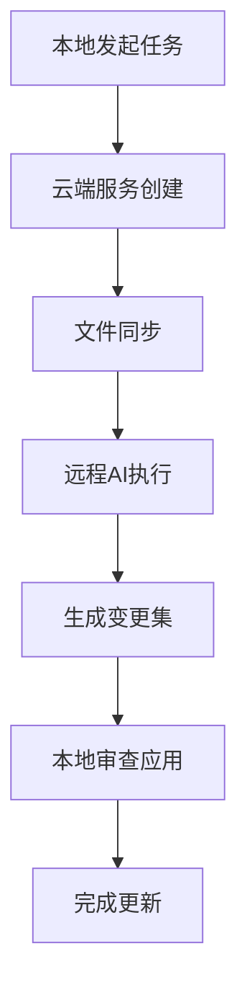

# 🔄 Cursor Background Agent 运行模式详解

## 📋 概述

Background Agent 是 Cursor IDE 的核心功能之一，它采用**云端服务模式**而非本地直接操作，为用户提供强大的AI辅助编程能力。

## 🏗️ 工作架构

### 1. 本地触发阶段
- 用户在 Cursor 中发起 Background Agent 任务
- 系统分析任务需求和本地文件结构
- 准备文件同步清单

### 2. 云端服务创建
- Cursor 在云端创建临时的开发环境实例
- 分配计算资源和存储空间
- 建立与本地环境的通信通道

### 3. 文件同步阶段
- 将本地工作区的相关文件复制到云端服务
- 保持文件结构和依赖关系
- 确保环境一致性

### 4. 远程执行阶段
- AI Agent 在云端环境中分析代码
- 执行代码生成、重构、优化等任务
- 利用云端强大的计算能力

### 5. 结果返回阶段
- 生成变更建议和代码修改
- 以 Git 分支或变更集形式组织结果
- 提供详细的修改说明

### 6. 本地应用阶段
- 用户审查云端生成的变更
- 通过分支合并或直接应用的方式更新本地代码
- 处理可能的冲突和调整

## 🎯 运行模式特点

### ✅ 优势
- **环境隔离**：不影响本地开发环境
- **资源扩展**：利用云端强大计算能力
- **并行处理**：可同时处理多个复杂任务
- **一致性保证**：避免本地环境差异问题
- **安全性**：敏感操作在隔离环境中进行

### ⚠️ 注意事项
- **网络依赖**：需要稳定的网络连接
- **延迟影响**：文件同步和结果返回有延迟
- **分支管理**：需要手动处理Git操作
- **成本考虑**：可能涉及计算资源费用
- **隐私保护**：代码会传输到云端服务

## 🔧 使用流程

## 💡 最佳实践

### 1. 任务规划
- 将复杂任务拆分为较小的单元
- 明确任务目标和约束条件
- 预估执行时间和资源需求

### 2. 文件管理
- 确保工作区文件结构清晰
- 避免同步不必要的文件
- 保持Git状态清洁

### 3. 结果处理
- 仔细审查AI生成的代码
- 理解修改逻辑和意图
- 适当调整和优化结果

### 4. 经验积累
- 记录成功和失败案例
- 总结最佳实践模式
- 建立个人使用指南

## 📚 学习建议

### 初级阶段
- 从简单任务开始熟悉流程
- 理解文件同步机制
- 掌握基本的Git操作

### 进阶阶段
- 尝试复杂重构任务
- 优化任务描述和约束
- 建立个人工作流程

### 高级阶段
- 自定义Agent行为
- 集成到团队开发流程
- 贡献最佳实践经验

## 🔍 常见问题

### Q: 为什么需要云端服务？
A: 本地环境资源有限，云端提供强大的AI计算能力和一致的执行环境。

### Q: 文件同步是否安全？
A: 传输过程加密，服务隔离，但建议避免上传敏感信息。

### Q: 如何处理网络问题？
A: 确保网络稳定，必要时使用代理或VPN。

### Q: 变更质量如何保证？
A: 仔细审查AI输出，结合人工判断，必要时进行调整。

## 📝 总结

Background Agent 的云端服务模式代表了AI辅助编程的新范式，它通过**隔离执行环境**、**云端资源扩展**和**结果本地应用**的方式，为用户提供了强大的编程辅助能力。理解这种运行模式有助于更好地利用Cursor的功能，提高开发效率。

---

*本文档将随着使用经验的积累持续更新和完善*
